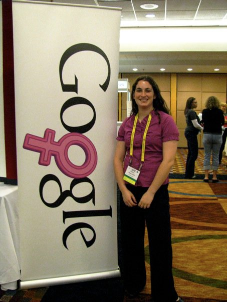
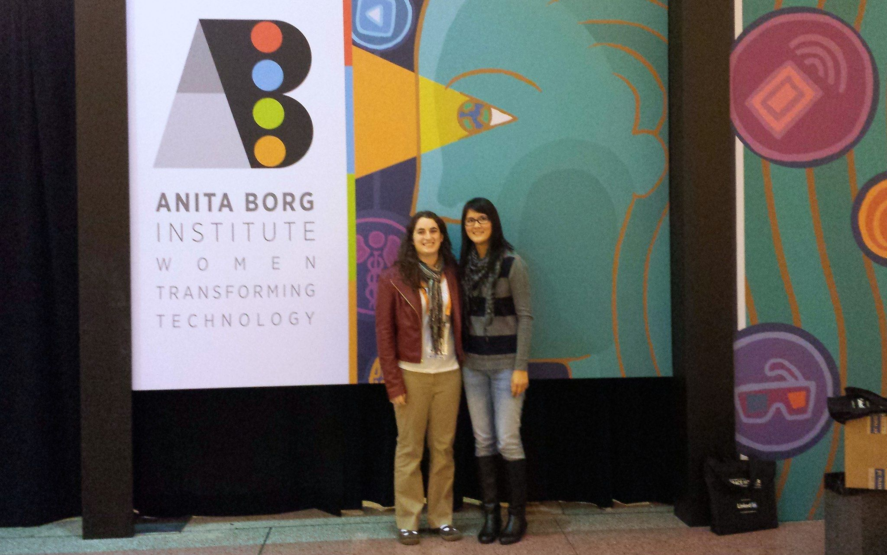
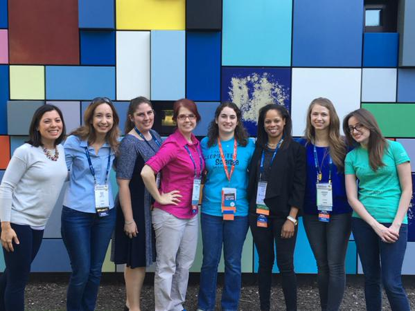

It's amazing how time flies; it seems like it was only yesterday I was boarding a plane for my first trip to GHC. Five years later, I've attended three times and helped 20 other people (including one speaker) get to GHC. It's been quite a journey!
<!--more-->
Five years ago, I was a junior in college. I hadn't done an internship at Facebook or Google. I wasn't participating in hackathons. I didn't have 10 iPhone apps in the app store making me money. In fact, I wasn't even sure I chosen the right major, despite loving what I was learning. There were many factors working against me (mostly self-imposed fears and doubts), and I'm still surprised that I stuck with computer science. However, when I look back to junior year, there's an experience that really did make a difference: the Grace Hopper Celebration of Women in Computing. 

In 2010, GHC was attended by just over 2100 people, including myself and a handful of other students from Rice. There were stories of women from the big tech companies, but also of women who in research, education, government, non-profits and management. At Rice, I felt like success was defined by a very specific set of experiences, however at GHC, I was seeing success defined in so many amazing and different ways, that for the first time, I felt like I belonged in this wonderful and diverse community.

Three years later, I returned to GHC as a full-time software engineer (with one of my team members). This time, I was no longer looking for validation; I wanted advice, ideas and inspiration... and man did GHC deliver! I felt that, again, Grace Hopper had helped me take a giant leap forward as an individual. 

When I returned from GHC in 2013, I began reaching out to others within my company. How could we give the GHC experience to others? How could our company take advantage of the amazing recruiting opportunity? How could we take the advice of so many at GHC and actually influence the company culture?

Then the stars aligned. We found out that GHC 2015 was going to be held here in Houston. The past few months have been a blur of planning meetings, scrambling for budget, excited emails and endless questions (directed to me as the resident GHC-expert). I've been happily overwhelmed to be a part of the process, and I'm very proud of the result. PROS sent 20 attendees and 1 speaker to the conference, hosted a networking reception, and got positive press for our involvement. With the announcement that #GHC16 will be held in Houston again, I can only imagine how PROS will grow its involvement and encourage even more women to stay and grow in technology.

I wish I remembered who originally offered me the opportunity to attend GHC as a student. I would go back and thank them and tell them how much of an impact it made on me. Because of that opportunity, I stayed in technology and I've been able to share the GHC experience with my company and colleagues. Like I said, it's been an amazing journey.

More about GHC: [http://gracehopper.anitaborg.org/](http://gracehopper.anitaborg.org/)

**2018 Update!**

I was very fortunate to have the opportunity to return to GHC this year through the [Hopper program](https://ghc.anitab.org/hoppers/). Hoppers are attendees who commit to spending approximately 6 hours volunteering with simple tasks during the course of the event. My assignments included assisting during the Women of Color luncheon and running the microphone for Q&A during two ABIE award-winner's sessions (including Holly Liu who recounted her experience cofounding game studio Kabam Games). It's a fantastic (but competitve) program that I highly recommend for anyone who has been fortunate enough to attend the conference and wants to give something back. 

Of course, the rest of the conference was a caffeine-fueled flood of inspiration! Just take a look at this picture of the Toyota Center filling up with young women and tell me you're not inspired!!

<blockquote class="twitter-tweet" data-lang="en">
Time for <a href="https://twitter.com/hashtag/GHC18?src=hash&amp;ref_src=twsrc%5Etfw">#GHC18</a>! 22,000 women in tech, all on one place! 🎉🎉🎉 <a href="https://t.co/YiWEtU9rcj">pic.twitter.com/YiWEtU9rcj</a>
&mdash; Robyn Moscowitz Narro (@robynmosco) <a href="https://twitter.com/robynmosco/status/1044953287412404225?ref_src=twsrc%5Etfw">September 26, 2018</a></blockquote>

Also memorable: my friend Dan and his PROS colleagues Eunice and Kieu presented a workshop called So Little Features, So Little Time, which is an adorable (and informative!) educational game which teaches basic Agile processes and team roles. They really did a fantastic job, and it was an added bonus of getting to reconnect with other PROS employees who were there to support them as well. Check out their material, which is all open source, [on Github](https://tiny.cc/SoManyFeatures)!
