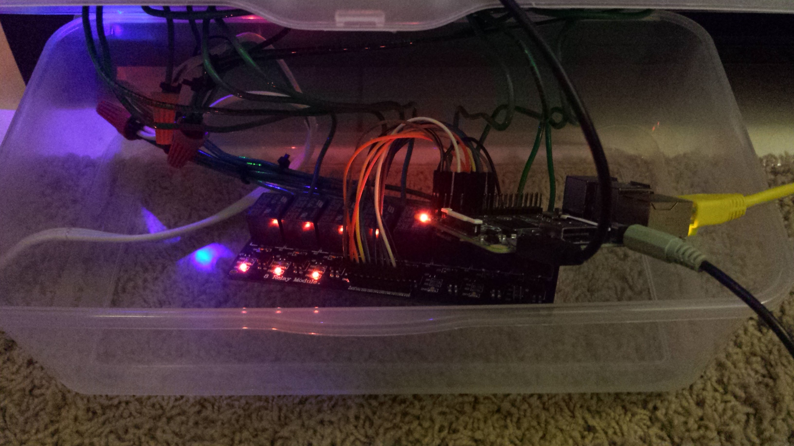
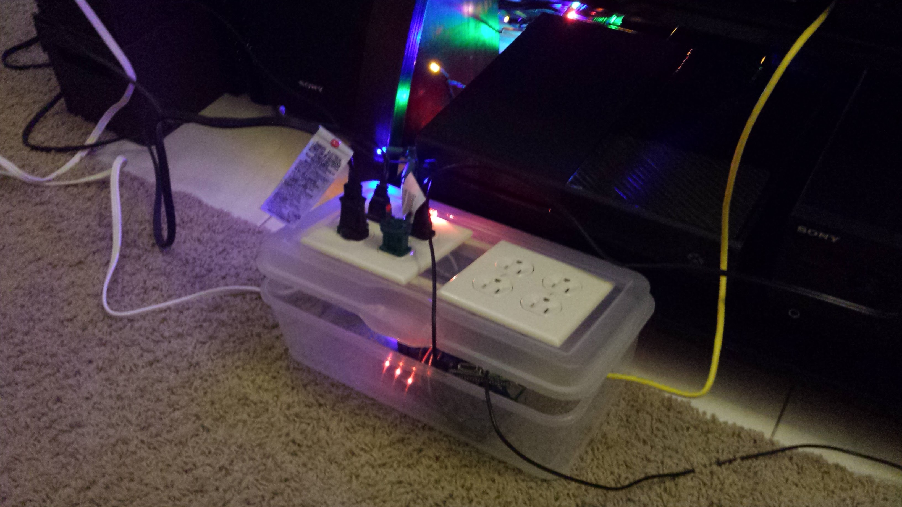
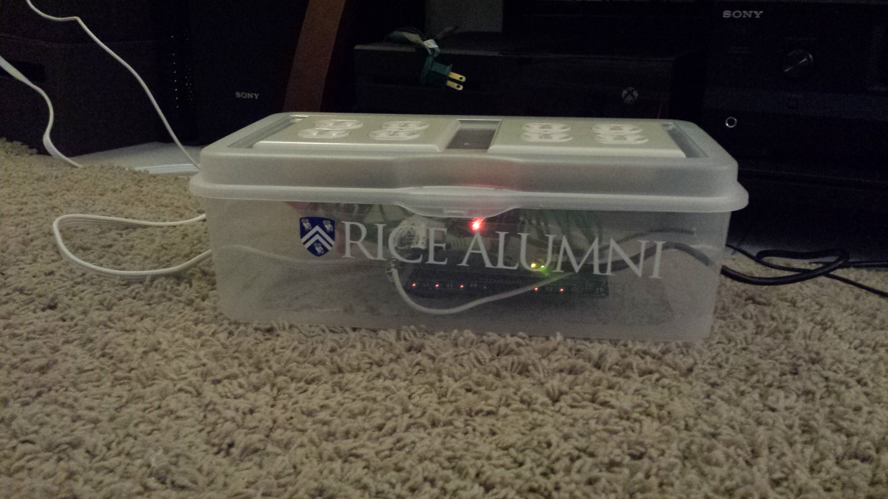

No wonder 2015 flew by so fast! We're already two months into 2016 and I'm just now posting about last December's adventures. By the time I'm ready to post about this month, it will probably be 2017!

So what made December so crazy? Besides typical holiday madness, I started a new job (woo!) and attempted a few fun projects.

### LightShowPi

What happens when you combine a Raspberry Pi, 2 IKEA floor lamps, 2 strings of Christmas lights, a plastic tree and
Mexicali Brass.

I have to say, this was an excellent way to spend a day of vacation. With Greg making the box to contain the raspi and rigging the relays and me installing Raspbian and lightshowpi, it only took a few hours from start to seizures. 

*Some assembly required.*

*Almost done!*

*Final product, with a sticker!*

If you'd like your own musical seizure machine, I used [lightshowpi](http://lightshowpi.org/getting-started/) to process the music and control the relays. The design of the wiring is up to you, but lightshowpi and Instructables have lots of tutorials!

### Book Review! (The Innovators: How a Group of Hackers, Geniuses, and Geeks Created the Digital Revolution)
For anyone interested by the brief, but fascinating history of the computer and world wide web, _The Innovators_ provides a sweeping overview of the main characters and events. I found this book to be a bit tedious, but full of great tid-bits and overall very captivating. I thought the author, Walter Isaccson, struggled with the narrative: the chapters became quite formulaic ("Here are some names of relevant people, where they're from and what their fathers did for a living. Together they accomplished something.") and by the end I was sick of being beat over the head with the same thesis over and over, but despite that, I still enjoyed this book. I was particularly interested in the final chapters about the birth of the world wide web and the Internet as we know it. Some amusing facts (which I've surprisingly retained for several months):

  * Larry Page actually named PageRank after himself (not because it literally ranked pages)
  * Sergey Brin and Larry Page celebrated their initial funding ($100,000 from Andy Bechtolsheim, cofounder of Sun Microsystems) by going to Burger King.
  * It was illegal to connect a commercial service (like AOL) to the Internet until 1992
  * At the beginning of 1993 there were 50 web servers in the world; by October there were 500.
  * The original wiki program was called WikiWikiWeb (wiki for short) because wiki means quick (and wiki wiki means superquick) in Hawaiian.
