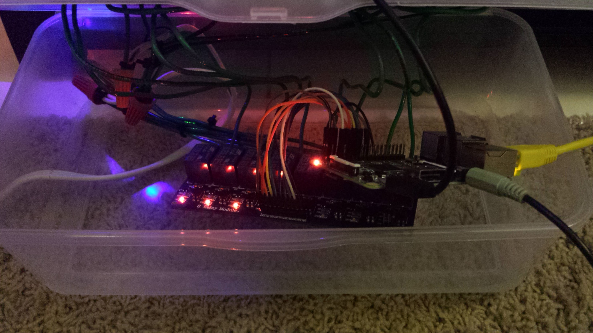
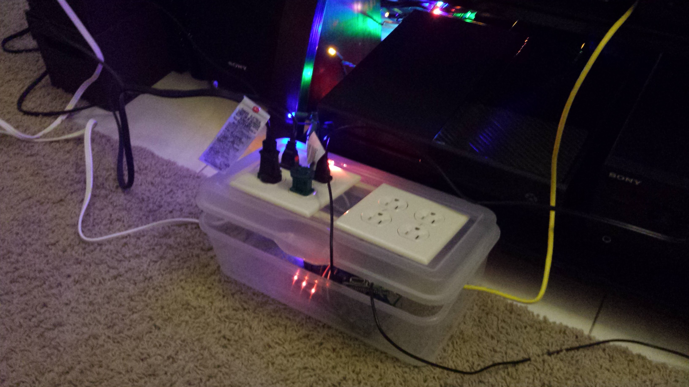

No wonder 2015 flew by so fast! We're already two months into 2016 and I'm just now posting about last December's adventures. By the time I'm ready to post about this month, it will probably be 2017!

So what made December so crazy? Besides typical holiday madness, I started a new job (woo!) and attempted a few fun projects.

### New Job
During September and October of last year, I started looking around for a new opportunity. I had been at my previous job for 3.5 years and was on the cusp of being a part of a brand new project, but things had stalled. It seemed to me I was perfectly placed for great exposure and career advancement... in a year or two when the project actually got off the ground. When I weighed the options of waiting to grow, or moving somewhere else and growing immediately, I decided a change was what I wanted for my career. I don't know where my career path will go, but I do know that more experiences can never hurt.

So, here I am: fortunate to be in a field where I can just decide to pick up and go, and immediately find a new and exciting opportunity. I've been at [iOffice](http://www.iofficecorp.com/) for 2 months now and I'm thrilled to be having the "small tech company" experience. And while I'm thankful to have escaped meetings and time tracking, I'm more thankful to be in a place where making technical decisions happens at all levels (not just by architects and technical leads). I'm sure I'll be writing more about this in the future.

### LightShowPi
Now that we've gotten past the serious stuff, let's talk about what happens when you combine a Raspberry Pi, 2 IKEA floor lamps, 2 strings of Christmas lights, a plastic tree and Mexicali Brass.

I have to say, this was an excellent way to spend a day of vacation. With Greg making the box to contain the raspi and rigging the relays and me installing Raspbian and lightshowpi, it only took a few hours from start to seizures. 

*Some assembly required.*

*Almost done!*

*Final product, with a sticker!*

If you'd like your own musical seizure machine, I used [lightshowpi](http://lightshowpi.org/getting-started/) to process the music and control the relays. The design of the wiring is up to you, but lightshowpi and Instructables have lots of tutorials!

### SWA auto-checkin with Docker
Like many Americans, I spent several hours of my holidays in an airport. Since I was flying Southwest, I had the unfortunate inconvenience of needing to check in _exactly_ 24 hours (to the second!) before my flight to get a good boarding number. In the past, I've successfully used scripts that found after wading through github, but this time I wanted to be a little smarter. Since I'd just reinstalled the operating system on my Mac, I decided to give Docker a try. The script that I wanted to run required about a gajillion Ruby dependencies which I just didn't want polluting my shiney new OS. Enter Docker + VirtualBox. 

For a one-off script, this was exactly what I needed. Even though the script didn't work (SWA has undoubtedly blocked it), it was definitely a fun exercise and I would totally use Docker again for projects with lots of dependencies I don't want on my machine (so... pretty much everything). 

### Book Review! (The Innovators: How a Group of Hackers, Geniuses, and Geeks Created the Digital Revolution)
For anyone interested by the brief, but fascinating history of the computer and world wide web, The Innovators provides a sweeping overview of the main characters and events. I found this book to be a bit tedious, but full of great tid-bits and overall very captivating. I thought the author, Walter Isaccson, struggled with the narrative: the chapters became quite formulaic ("Here are some names of relevant people, where they're from and what their fathers did for a living. Together they accomplished something.") and by the end I was sick of being beat over the head with the same thesis over and over, but despite that, I still enjoyed this book. I was particularly interested in the final chapters about the birth of the world wide web and the Internet as we know it. Some amusing facts (which I've surprisingly retained for several months):
* Larry Page actually named PageRank after himself (not because it literally ranked pages)

