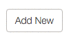

For my first technical post, I thought I'd start small and write about a fun little feature that I worked on it earlier this week. It's by no means new, but it was new (and amusing!) to me.

### The Situation
I needed to draw the user's attention to a button after they've arrived on a page. If you're thinking "I bet she's gonna talk about animations"... YOU'RE RIGHT!

### The Players
This application (and the code examples below) are Angular, ES6 and CSS3/LESS.

### The Context
I have two angular directives; let's call them the main panel and configuration panel. Each of these panels/directives correspond to different angular states.

In the template of the main panel, I have a message with an embedded link.

```html
<span>
  You can't do that here. Please go to the 
  <a ng-click="mainController.click(id, mainController.animateButton)">
    configuration page
  </a>.
</span>
```

Clicking the link will call the click function on the controller. Notice that two arguments are passed: an id and the animateButton function (from the directive's controller).

```javascript
  // note: the controller class has been extended to include $state and $timeout

  click(id, callback = () => {}) {
    this.$state.go('configuration', { id }).then(this.$timeout(callback));
  }

  animateButton() {
    const result = document.getElementsByClassName('the-btn');
    const wrappedResult = angular.element(result);
    wrappedResult.addClass('btn-pulse');
  }
```

I love that the click function is so simple. Even though it's just one line, it actually does a lot: first, go to the 'configuration' state, then (since $state.go returns a promise) wait for 1 digest cycle (which let's the template for that state render) and call the callback. Notice that the callback argument has a default value (an empty function) which means you can reuse this function for navigation, but you don't have to pass a callback function if you don't need to do anything once you get to that state.

The animateButton is less interesting. Since angular's jqlite doesn't provide a way to search by class name, I'm using the getElementsByClassName function to get the button (which is in the configuration panel's template), wrapping it in jqlite then adding a new class called 'btn-pulse'. You can probably guess what's coming up next!

Our application uses LESS, so to make my life a little easier, I'm making use of two LESS mixins.

```css
.keyframes(@name, @arguments) {
  @-moz-keyframes @name { @arguments(); }
  @-webkit-keyframes @name { @arguments(); }
  @keyframes @name { @arguments(); }
}

.animation(@arguments) {
  -webkit-animation: @arguments;
  -moz-animation: @arguments;
  animation: @arguments;
}
```

These two mixins generate browser-specific prefixes for keyframes and animation. That means all I have to do to produce a pulsing effect for all non-IE browsers is:

```css
.btn-pulse {
  .keyframes(greenPulse; {
    50% { box-shadow: 0 0 18px @green; }
  });

  .animation(greenPulse 1.5s infinite);
}
```

The btn-pulse class first uses the keyframes mixin to generate a set of keyframes called greenPulse which, over the duration of the animation, will transition to a green shadow (when the transition is 50% complete) then back to it's starting state. Then, use the animation mixin to use the greenPulse keyframes in a 1.5-second animation which will loop forever.

The final bit is to add some behavior to the button so that when you hover over it, it will stop pulsing.

```html
<button type="button" class="the-btn btn btn-default" 
        ng-mouseenter="configController.clearAnimations($event)">
  Add New
</button>
```

```javascript
clearAnimations(event) {
  angular.element(event.target).removeClass('add-depth-btn-pulse');
}
```

The final result is a nice radioactive glow!


