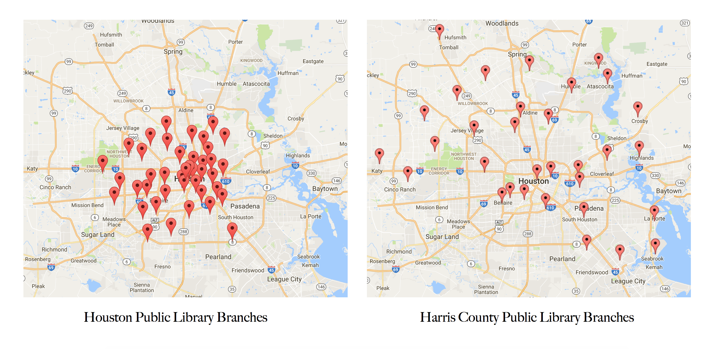
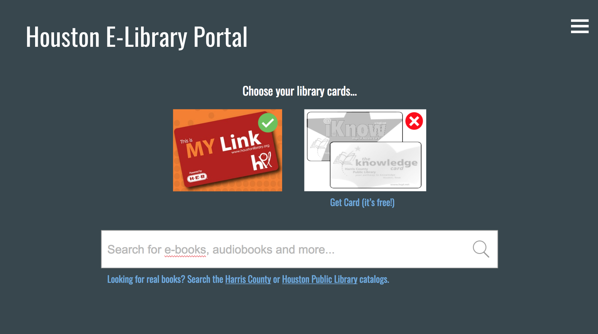

Rewind to May 2017. Summer was in full swing, and tech nerds from all around Houston were getting ready for the annual [Houston Hackathon](http://houstonhackathon.com/). During this fantastic event, hosted by [Sketch City](http://sketchcity.org/), participants get together to create maps, charts, apps and websites all with the purpose of improving the lives of our neighbor Houstonians. 

During the weeks leading up to the Hackathon, an idea was percolating in the back of my mind; it was a challenge that I'd encountered in my day-to-day life, and I was pretty confident that a solution would not only bring me some relief, but might also be enjoyed by a wider audience. 

Fun fact: Houston is the fourth largest city in the country, and one of the benefits of being the fourth largest city in the country is that you have a _lot_ of public services. For example, we have not just one, but TWO library systems. Check it out:

Super! Let's say I want a specific book. I fire up the trusty web browser and head over to the Houston Public Library website. Nope, my book's not available. But hey, I'm a Houston resident, I've got two library cards! What about the Harris County Public Library website? Bingo, there's my book!

Sure, it's not a life or death problem. It's not even really a problem! Both library systems have easily searchable catalogs, so what's the big deal? The big deal was: this was a PERFECT hackathon project. It checked my two "must have" boxes:

1. It's doable. I want a search bar where I can search both catalogs. That's it. Nothing fancy.
2. It's valuable. Nearly EVERYONE who I talked to about this project had no idea there were two library systems in Houston. Even if we didn't get the search bar working, at a very minimum, we could educate people about the mere existence of these two great resources.

Fast forward to the week before the hackathon. A little preparation needed to be done if we were actually going to get this thing working. First, and most importantly, we needed a way to retrive search results. Enter [Overdrive](https://www.overdrive.com/), the digital content provider for most public and school libraries in the US. Overdrive has a [public API](https://developer.overdrive.com/docs/getting-started) which made this entire dream possible. I sent a request for a developer license, with the ability to access the catalogs of both Houston area libraries. A few days later, I was approved and ready to rock.

Next up, I [submitted my idea](https://github.com/sketch-city/project-ideas/issues/114) to the list of project ideas, and began recruiting friends and coworkers to join my team. I was positive I could code the front-end for this project myself, no problem, but the back end was a bit of a problem. I definitely needed additional help, but I know some pretty awesome people. As the hackathon approached, the A-team was ready to go.

On Saturday morning, while the Hackathon was just beginning, our tiny team claimed a conference room in the Houston Technology Center and began brainstorming. By noon, we had covered a white board with ideas, nearly doubled the size of our team, and worked up quite an appetite for lunch. An early mock up of our project (with moody gray background) got us focused and ready for action.

Finally, we were ready to code. Our chosen tech stack included: 
* React for the front end
* Node to scrape Overdrive
* Node/Express for our back end
* Postgres with knex to store the results from Overdrive
* Hosted on AWS EC2

Several hours later, we had a shiny new name ("Houston Book Link"), an almost working product, and a strong desire to get some sleep.

<blockquote class="twitter-tweet" data-lang="en">
Houston Libraries team is still hacking away! <a href="https://twitter.com/hashtag/timeformorecoffee?src=hash&amp;ref_src=twsrc%5Etfw">#timeformorecoffee</a> <a href="https://twitter.com/hashtag/progress?src=hash&amp;ref_src=twsrc%5Etfw">#progress</a> <a href="https://twitter.com/hashtag/hackhou?src=hash&amp;ref_src=twsrc%5Etfw">#hackhou</a> <a href="https://t.co/vSr04jq1Xc">pic.twitter.com/vSr04jq1Xc</a>
&mdash; Robyn M N (@r0bynb1rd) <a href="https://twitter.com/r0bynb1rd/status/866158337041346561?ref_src=twsrc%5Etfw">May 21, 2017</a></blockquote>

The following day, we fought the good fight with AWS, prepared our presentation and did last minute bug fixing. Our 3-minute demo went as well as could be expected, and I have to say, I was incredibly proud. We had a working product (we purchased the domain name that afternoon) and of the [24 submitted projects](https://houstonhackathon5.devpost.com/submissions), we were selected as one of the three winners!! 

<blockquote class="twitter-tweet" data-lang="en">
We&#39;re winners!!! Time to start shopping for a domain. 😂 Shout out to this amazing team! <a href="https://twitter.com/hashtag/houstonbooklink?src=hash&amp;ref_src=twsrc%5Etfw">#houstonbooklink</a> <a href="https://twitter.com/hashtag/hackhou?src=hash&amp;ref_src=twsrc%5Etfw">#hackhou</a> <a href="https://t.co/bCxRXV2UFZ">pic.twitter.com/bCxRXV2UFZ</a>
&mdash; Robyn M N (@r0bynb1rd) <a href="https://twitter.com/r0bynb1rd/status/866386871076651009?ref_src=twsrc%5Etfw">May 21, 2017</a></blockquote>

Our prize was a meeting with the mayor of Houston (as well as meeting with directors of both library systems!!) and high fives all around.

<blockquote class="twitter-tweet" data-lang="en">
This afternoon, I sat down w/top three winners from this year&#39;s Houston <a href="https://twitter.com/hashtag/Hackathon?src=hash&amp;ref_src=twsrc%5Etfw">#Hackathon</a>. Looking forward to collaborating w/them. <a href="https://twitter.com/hashtag/houhack?src=hash&amp;ref_src=twsrc%5Etfw">#houhack</a> <a href="https://t.co/Gz4DkWsnMJ">pic.twitter.com/Gz4DkWsnMJ</a>
&mdash; Sylvester Turner (@SylvesterTurner) <a href="https://twitter.com/SylvesterTurner/status/883182635475914754?ref_src=twsrc%5Etfw">July 7, 2017</a></blockquote>

As someone who's only ever participated in civic hackathons, I can't say enough good things about the experience. It's a fantastic way to meet new people, try new technologies, and (if you're lucky) produce something that's valuable to your community. And if you're in Houston, free tacos!

Check out our project here at [houstonbook.link](http://www.houstonbook.link/#/) and on [Github](https://github.com/rmoscowitz/houston-book-link).
